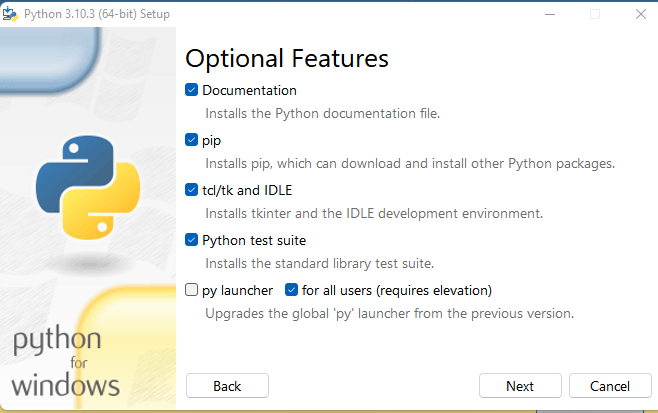
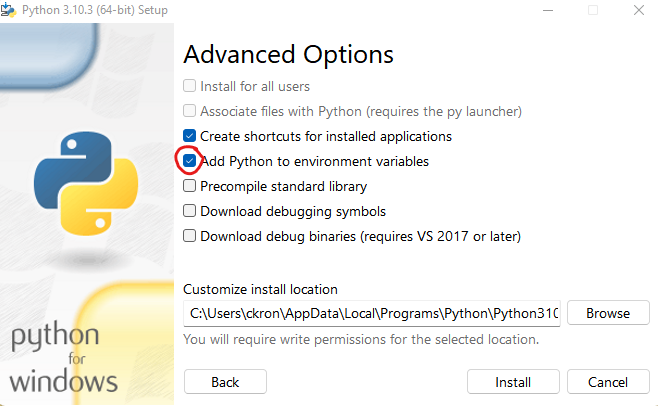
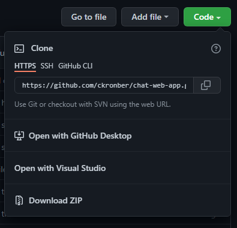
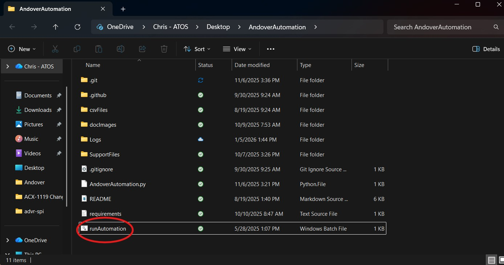
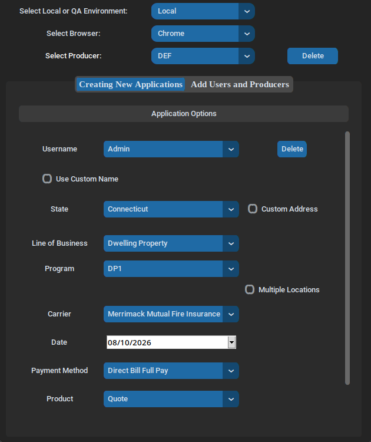
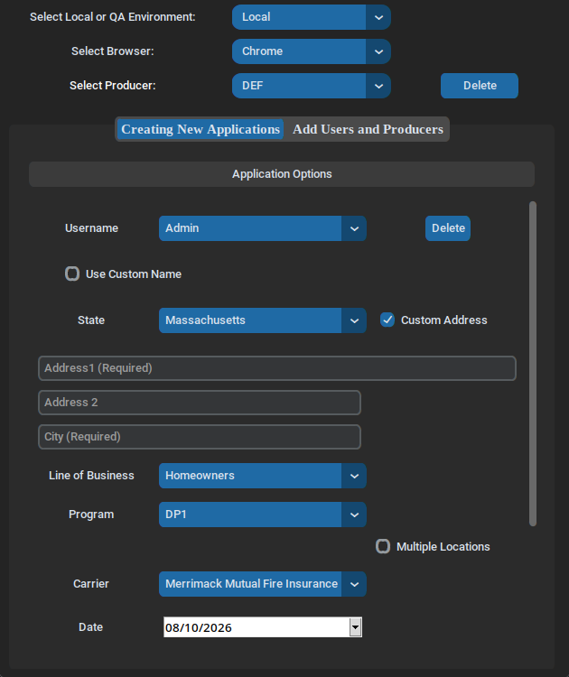
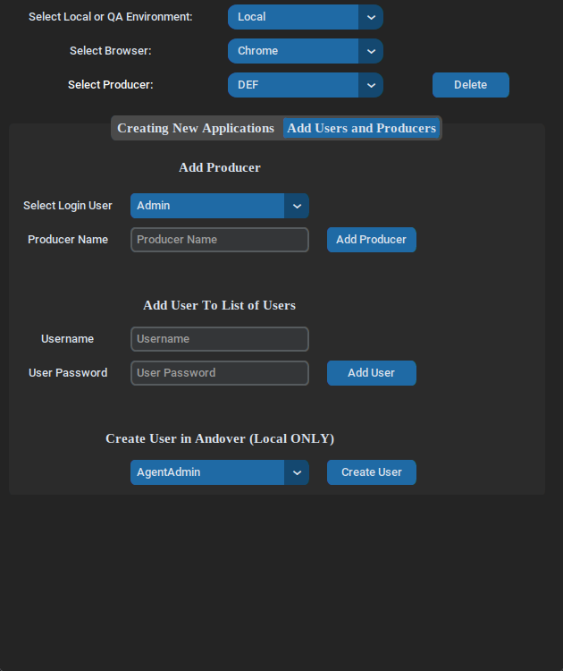

# AndoverAutomation
Python Automation with GUI for Andover Local and QA Environments with an intuitive modern user interface.

## Features
- **Modern GUI** - Built with CustomTkinter for a clean, professional interface
- **Multi-Environment Support** - Test against Local, QA, QA2, UAT3, and UAT4 environments
- **Flexible Testing** - Create quotes, applications, or full policies
- **Browser Support** - Automate with Chrome or Firefox
- **Multiple Lines of Business** - Support for Dwelling Property, Homeowners, Businessowners, Personal Umbrella, and Commercial Umbrella
- **Custom Data Entry** - Use custom names and addresses for testing
- **User Management** - Easily add and manage test users and producers
- **Fast Setup** - Uses UV for lightning-fast dependency installation

---

### If you find any bugs or features you would like added, click on the Issues tab on GitHub, then click the New Issue button and select either Bug Report or Feature Request and fill out the information.

### Quick Start Notes
- If you already have Python 3.12 or later installed, you can skip the Python installation section
- A `.bat` file (Windows) and shell script (Linux/Mac) are provided to easily run the automation software
- On Windows: Copy the `runAutomation.bat` file as a shortcut to your desktop for quick access
- On Linux/Mac: Use `./runAutomation` from the project directory

---

## 1. Installing Python
**Latest Recommended Version: Python 3.14.7** (Released August 5, 2026)

- Click [here](https://www.python.org/ftp/python/3.14.7/python-3.14.7-amd64.exe) to download Python 3.14.7 for Windows (64-bit)
- Or visit [python.org/downloads](https://www.python.org/downloads/) to download the latest version for your operating system


&emsp; <a href="https://www.python.org/downloads/"></a>
<br>
<br>

&emsp;&emsp;&emsp;&emsp;- Make sure the pip selection is checked like it is  in the image below.
<br>
<br>
<p align="center" width="100%"></p>
<br>
<br>
&emsp;&emsp;&emsp;&emsp;- Make sure to add the environment variable checkbox when installing Python also.
<br>
<br>
<p align="center" width="100%"></p>
<br>
<br>
<br>
<br>

<h4>&ensp; 1. Verify Python Installation</h4>

Check the Python version to confirm it's installed correctly. Open a command prompt or terminal (this can also be done from VS Code):

&emsp;&emsp;&emsp;&emsp;```python --version```

&emsp;&emsp;&emsp;&emsp;- If successful, it should return: `Python 3.14.7` (or your installed version)

&emsp;&emsp;&emsp;&emsp;- If the command doesn't work, try these alternatives:

&emsp;&emsp;&emsp;&emsp;&emsp;```py --version```

&emsp;&emsp;&emsp;&emsp;&emsp;```python3 --version```

<br>
<h4>&ensp; 2. Verify pip Installation</h4>

Check that pip (Python's package installer) is installed:

&emsp;&emsp;&emsp;&emsp;&emsp;```pip --version```

&emsp;&emsp;&emsp;&emsp;&emsp;```pip3 --version```

If needed, you can also try version-specific commands like `pip3.14 --version` 

<br>
<h4>&ensp; 3. Clone the Repository</h4>

<p align="center" width="100%"></p>

Click the green "Code" button on GitHub, then copy the repository URL. Use this command to clone the repository:

&emsp;&emsp;&emsp;&emsp;&emsp;```git clone https://github.com/ChrisKronbergADVR/AndoverAutomation.git```

Alternatively, you can click "Download ZIP" to download the project as a compressed file.

<hr>
<br>

### 2. Setting Up the Project Environment

This project uses **uv** for fast, reliable dependency management. UV is a modern Python package installer written in Rust that is significantly faster than traditional pip.

#### Option A: Using uv (Recommended - Fastest Method)

**Why use uv?**
- 10-100x faster than pip for installing dependencies
- Automatic virtual environment management
- Better dependency resolution
- Production-ready and actively maintained

**Installation Steps:**

1. **Install uv** (if not already installed):
   ```bash
   pip install uv
   ```
   Or use pip3:
   ```bash
   pip3 install uv
   ```

2. **Navigate to the project directory:**
   ```bash
   cd AndoverAutomation
   ```

3. **Create a virtual environment with uv:**
   ```bash
   uv venv
   ```

4. **Activate the virtual environment:**
   - On **Windows**:
     ```bash
     .venv\Scripts\activate
     ```
   - On **macOS/Linux**:
     ```bash
     source .venv/bin/activate
     ```

5. **Install project dependencies:**
   ```bash
   uv pip sync
   ```
   Or if you need to install from requirements.txt:
   ```bash
   uv pip install -r requirements.txt
   ```

#### Option B: Using Traditional pip

If you prefer using the standard Python package installer:

1. **Navigate to the project directory:**
   ```bash
   cd AndoverAutomation
   ```

2. **Create a virtual environment (recommended):**
   ```bash
   python -m venv .venv
   ```

3. **Activate the virtual environment:**
   - On **Windows**:
     ```bash
     .venv\Scripts\activate
     ```
   - On **macOS/Linux**:
     ```bash
     source .venv/bin/activate
     ```

4. **Install dependencies:**
   ```bash
   pip install -r requirements.txt
   ```
   If the above doesn't work, try:
   ```bash
   pip3 install -r requirements.txt
   ```

### 3. Running the Automation

Once the dependencies are installed, you can run the automation software:

**On Windows:**
- Double-click the `runAutomation.bat` file

**On Linux/Mac:**
- Run the shell script:
  ```bash
  ./runAutomation
  ```
- Or run directly with Python:
  ```bash
  python -m andover_automation
  ```

<p align="center" width="100%"></p>

<hr>

## 2. Using the GUI

### The application features a modern, intuitive user interface with the following components:

<br>

### Main Testing Tab

<p align="center" width="100%"></p>
<p align="center"><strong>Main Testing Interface</strong></p>

The main tab provides all the controls you need for automation testing:

1. **Environment Selection** - Choose between Local, QA, QA2, UAT3, or UAT4 environments
2. **Browser Selection** - Select Chrome or Firefox for automation
3. **Producer Selection** - Choose the producer for your test session (with delete option)
4. **Username** - Select or add test users (with delete option)
5. **Custom Name** - Option to use custom insured names
6. **State Selection** - Choose the state for quotes, applications, or policies
7. **Custom Address** - Enable to enter specific addresses for testing
8. **Line of Business** - Select from Dwelling Property, Homeowners, Businessowners, Personal Umbrella, or Commercial Umbrella
9. **Effective Date** - Pick a date using the calendar picker or enter manually
10. **Insured Information** - Enter first and last name fields
11. **Submission Type** - Choose between Quote, Application, or Policy
12. **Payment Method** - Select the payment plan
13. **Submit/Cancel** - Execute the automation or cancel the operation

<br>

### Address Verification View

<p align="center" width="100%"></p>
<p align="center"><strong>Custom Address Entry</strong></p>

When "Custom Address" is enabled, you can:
- Enter complete address details manually
- Verify the address before proceeding
- Ensure accurate location data for testing

<br>

### Add Users and Producers Tab

<p align="center" width="100%"></p>
<p align="center"><strong>User and Producer Management</strong></p>

This tab allows you to:

1. **Add Users** - Enter username and password credentials for new test users
2. **Add Producers** - Register new producer names for testing
3. **Environment-Specific** - Users and producers are tied to the selected environment
4. **Easy Management** - Quickly add credentials needed for your automation workflows

---

## Requirements

- **Python**: 3.12 or later (3.14.7 recommended)
- **Operating System**: Windows, macOS, or Linux
- **Browser**: Chrome or Firefox installed on your system
- **Dependencies**: All listed in `requirements.txt` and `pyproject.toml`

## Troubleshooting

### Virtual Environment Issues
If you encounter issues with the virtual environment:
1. Delete the `.venv` folder
2. Recreate it using either `uv venv` or `python -m venv .venv`
3. Reinstall dependencies

### Display Issues on Linux
If you're running on a headless Linux system and need GUI support:
```bash
sudo apt-get install python3-tk
```

### Permission Issues on Linux/Mac
If the `runAutomation` script won't execute:
```bash
chmod +x runAutomation
```

### Browser Driver Issues
The automation uses Selenium, which requires browser drivers. If you encounter driver issues:
- Ensure your browser (Chrome/Firefox) is up to date
- The Selenium package should automatically manage drivers, but you can manually install them if needed

## Project Structure

```
AndoverAutomation/
├── andover_automation/          # Main application package
│   ├── SupportFiles/           # Core automation logic and UI
│   └── __main__.py             # Application entry point
├── csvFiles/                   # CSV data files for testing
├── docImages/                  # Documentation images
├── Logs/                       # Application logs
├── .venv/                      # Virtual environment (created during setup)
├── pyproject.toml              # Project configuration
├── requirements.txt            # Python dependencies
├── uv.lock                     # UV lock file for reproducible builds
├── runAutomation               # Linux/Mac launcher script
├── runAutomation.bat           # Windows launcher script
└── README.md                   # This file
```

## Support

For questions, issues, or feature requests:
1. Check existing [GitHub Issues](https://github.com/ChrisKronbergADVR/AndoverAutomation/issues)
2. Create a new issue with detailed information
3. Use the appropriate template (Bug Report or Feature Request)

---

**Version**: 1.0.0  
**Last Updated**: August 10, 2026  
**Python Version**: 3.14.7 (recommended)
